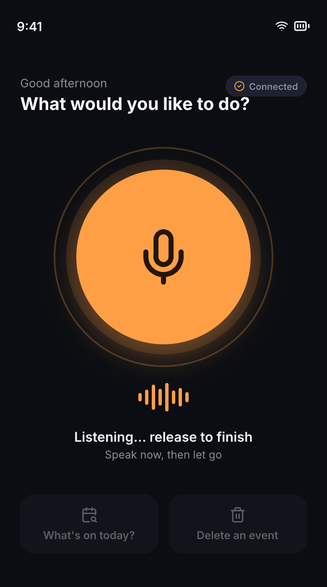
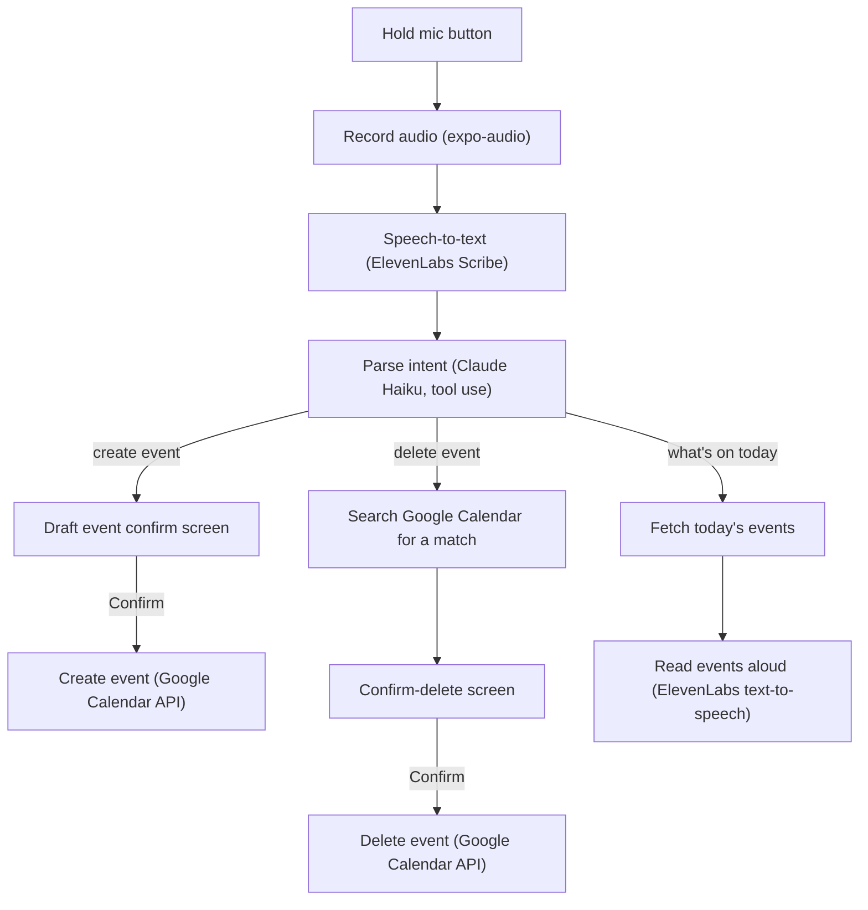

# Voice Calendar Assistant

A hands-free Google Calendar assistant built with [Expo](https://expo.dev) and
[expo-router](https://docs.expo.dev/router/introduction). Hold a button, speak,
and it creates, checks, or deletes events on your Google Calendar — designed
for use while driving.



## Features

- **Create an event by voice** — "Dentist appointment tomorrow at 2pm for an hour"
- **Check what's on today** — read back out loud via text-to-speech
- **Delete an event by voice** — finds the matching event and asks for confirmation before deleting
- Every create/delete action shows a confirm screen ("Did I get this right?") before touching your calendar
- Sign-in via Google OAuth, scoped to calendar events only

## How it works

Every voice command goes through the same pipeline: record → transcribe →
parse intent → act. "Create" and "delete" both stop at a confirm screen
before touching your calendar; "what's on today" skips straight to a spoken
readout.



## Tech stack

- [Expo SDK 57](https://docs.expo.dev/versions/v57.0.0/) + expo-router, TypeScript
- [@react-native-google-signin/google-signin](https://github.com/react-native-google-signin/google-signin) for OAuth, [Google Calendar API v3](https://developers.google.com/calendar/api/v3/reference) for events
- [ElevenLabs](https://elevenlabs.io) for speech-to-text and text-to-speech
- [Anthropic Claude](https://www.anthropic.com) (Haiku, forced tool use) to turn a transcript into structured event data
- `expo-symbols` (SF Symbols on iOS), `expo-audio`, native tabs — this app needs a real native build; it isn't fully testable in `expo start --web`

## Get started

1. Install dependencies

   ```bash
   npm install
   ```

2. Add your API keys to `.env.local` in the project root:

   ```bash
   EXPO_PUBLIC_ANTHROPIC_API_KEY=sk-ant-...      # console.anthropic.com/settings/keys
   EXPO_PUBLIC_ELEVENLABS_API_KEY=...            # elevenlabs.io/app/settings/api-keys
   EXPO_PUBLIC_ELEVENLABS_VOICE_ID=...           # elevenlabs.io/app/voice-library
   ```

   Google Sign-In client IDs are already configured in
   `src/lib/google-calendar-auth.ts` for this project. If you fork this repo,
   swap in your own OAuth client IDs from the
   [Google Cloud Console](https://console.cloud.google.com/apis/credentials).

3. Run it. Voice features depend on native modules (`expo-audio`,
   `expo-symbols`, native tabs), so use a real build rather than Expo Go or web:

   ```bash
   npx expo run:ios       # or: npm run ios
   npx expo run:android   # or: npm run android
   ```

   `npx expo start --web` also works for previewing layout/screens quickly,
   but Google Sign-In and audio recording aren't available there.

### Testing & linting

```bash
npm test          # Jest (jest-expo preset)
npm run lint       # expo lint (ESLint)
npx tsc --noEmit   # TypeScript
```

## Project structure

- `src/app/` — expo-router routes; `index.tsx` is the voice assistant screen
- `src/lib/` — voice pipeline, Google Calendar API/auth, and Claude-based transcript parsing (each paired with a `*.test.ts`)
- `src/hooks/` — session state (`use-google-calendar-session.ts`) and theme hooks
- `src/constants/` — `theme.ts` (app-wide light/dark tokens) and `voice-theme.ts` (fixed dark palette for the voice screens)
- `design/` — pen.dev source and exported screen mockups (`design/screens/`)

See `CLAUDE.md` / `AGENTS.md` for more detail on conventions and iOS build gotchas.

## Learn more

- [Expo documentation](https://docs.expo.dev/versions/v57.0.0/)
- [Expo Router](https://docs.expo.dev/router/introduction)
